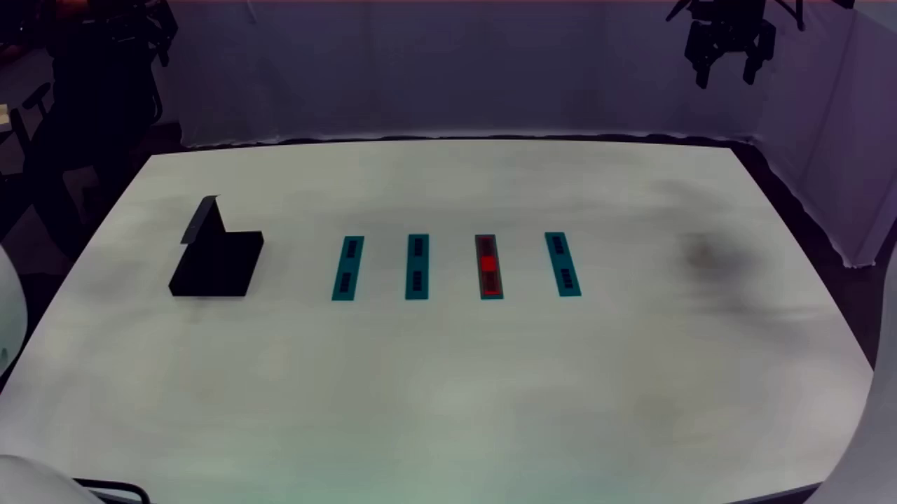

# LABS 双臂与夹爪回放系统：中文使用说明

适用环境：Linux x86_64 工作站、Franka 双 FR3、Robotiq 夹爪与兼容头部相机。示例下载目录为 `~/franka_labs_episode_replay`，脚本会自动确定仓库路径。首次在新机器部署，请先阅读 [仓库首页的安装步骤](README.md)，准备镜像并修改站点配置。

这套工具把已录制的 LeRobot 数据中的双臂关节目标和夹爪开度，按录制顺序发送给 LABS 控制器。当前包含四条固定轨迹，以及用于摆放桌面和物体的 `cali` 实时叠图窗口。

**回放前必须让底层服务正常运行。** 只给机械臂通电、只打开网页，或者只运行 `bash replay.sh`，都不等于底层控制器已经就绪。`task stop` 会连底层驱动一起关闭，之后需要重新启动。

## 1. 最常用的操作流程

先给双臂、夹爪和相机供电，连接网络与 USB，在两台机械臂的 Desk 中启用 FCI。FCI 是外部程序与机械臂控制柜通信的接口。若正在录制或遥操作，先在采集页面结束录制、停止遥操作。

然后在 连接机器人的 Linux 本机桌面终端执行：

```bash
cd ~/franka_labs_episode_replay

# 第一步：启动双臂驱动、夹爪驱动、控制协调器和头部相机。
# 启动后自动读取状态检查；不会自动播放轨迹。
bash replay_services.sh start
```

看到 **“底层回放检查通过”** 后，进行场景校准：

```bash
# 第二步：打开实时叠图窗口，手动对齐桌面及物体。
bash replay.sh cali
```

校准完成，按 `Q` / `Esc` 或关闭窗口，然后选择回放：

```bash
# 第三步：打开菜单，输入 1、2、3 或 4。
bash replay.sh
```

**输入数字后会开始实际执行**：检查、夹爪初始化与开合验证、双臂归位、轨迹播放。请先完成场景摆放，夹爪保持空载，人员离开运动范围。

也可以全程使用同一个入口：运行 `bash replay.sh`，先输入 `start`；命令结束后再次运行，输入 `cali`；校准结束后再次运行，输入轨迹数字。菜单每次执行一项后退出。

## 2. 为什么需要底层服务

| 服务 | 作用 | 什么时候需要 |
| --- | --- | --- |
| `franka-robot` | 连接左右 FR3，提供关节反馈、关节跟随控制器和控制器管理服务 | 实机回放、归位、状态检查 |
| `robotiq-gripper` | 连接两只 Robotiq 夹爪，提供开度指令、反馈与重新激活服务 | 当前所有实机回放及检查模式 |
| `controller-coordinator` | 管理左右臂从空闲到跟随、再停止的状态切换 | 实机回放、归位、状态检查 |
| `zed-camera-head` | 发布头部相机画面 | `cali` 实时叠图 |

回放本身使用已经保存的动作数据，不依赖实时相机。单独打开 `cali` 只需要头部相机。默认启动脚本把四项一起启动，方便先校准再回放。

这里有两个不同层次：

- **服务/驱动在运行**：机械臂和夹爪能被发现、能返回反馈。
- **机械臂运动控制器已激活**：机械臂开始接受目标并跟随运动。

正常的回放准备状态是：底层服务运行，双臂的 `joint_follower_controller` 与 `gravity_compensation_controller` 都为 `inactive`，控制协调器为 `IDLE`。回放脚本负责在需要运动时激活，再在结束时停用。关节状态广播器和夹爪控制器应为 `active`。

**不要为了准备回放，手动把双臂切到跟随状态。** `check` 会检查上述准备状态；状态不符合时会拒绝继续。

## 3. 底层服务脚本

文件：[replay_services.sh](replay_services.sh)。所有命令均在 `~/franka_labs_episode_replay` 执行。

### 3.1 启动回放所需服务

```bash
bash replay_services.sh start
# 等价入口：
bash replay.sh start
```

脚本使用现有 `example_station` 的 Docker Compose 配置和本地镜像，依次完成：

1. 启动双臂、夹爪、控制协调器、头部相机；已存在的容器直接复用，不强制重建，不重新构建或下载镜像。
2. 打印服务的容器状态。
3. 调用 `bash replay.sh 3 check`，读取双臂与夹爪反馈，检查控制器状态及其他指令发布器。
4. 若尚未就绪，间隔 3 秒重试，最多 6 次；每次检查自身还需要 ROS 发现和服务响应时间。
5. 检查通过后退出，由操作员选择校准或回放。失败也会退出，保留已启动的服务，便于查看日志与修复。

`start` 不发送回放轨迹，不过**新启动夹爪驱动可能执行硬件初始化开合**。后续的只读检查不发送运动指令。若已有 `labs-dataset-replay` 容器在运行，脚本会拒绝再次 `start`、`check` 或 `stop`，避免干扰当前回放/检查。

启动时用轨迹 `3` 检查，主要是读取共同的硬件状态，同时报告相对轨迹 `3` 起点的误差。它不会改变菜单的轨迹绑定；之后选择其他数字时，还会进行该轨迹自己的检查。

### 3.2 仅启动回放底层，或仅启动相机

```bash
# 不需要 cali 时，只启动双臂、夹爪和协调器：
bash replay_services.sh start --no-camera

# 只做桌面/物体叠图时，只启动头部相机：
bash replay_services.sh camera
bash replay.sh cali
```

`--no-camera` 表示本次不启动相机；如果相机原本在运行，它会继续运行。`start` 的就绪检查针对回放硬件；相机是否实际出图，在 `cali` 中确认，也可运行：

```bash
bash replay.sh cali --headless --seconds 10
```

### 3.3 查看状态、检查反馈和读取日志

```bash
# 容器状态，包括已退出的容器：
bash replay_services.sh status
# 等价入口：bash replay.sh status

# 实际反馈和控制器状态，默认使用轨迹 3：
bash replay_services.sh check
bash replay_services.sh check 1

# 最近 100 行日志：
bash replay_services.sh logs
bash replay_services.sh logs franka-robot
bash replay_services.sh logs robotiq-gripper
bash replay_services.sh logs controller-coordinator
bash replay_services.sh logs zed-camera-head
```

`status` 中显示 `Up` 只说明容器进程仍在。驱动可能在重试 FCI 连接，或内部夹爪节点已失败，因此应以 `check` 的实际反馈检查为准。

### 3.4 停止底层服务

先在回放终端按 `Ctrl+C`，等待停止流程结束并出现 `Both arm controllers verified inactive.`；如果采集网页还在遥操作，也先在网页停止。之后执行：

```bash
bash replay_services.sh stop
# 等价入口：bash replay.sh stop
```

此命令停止双臂、夹爪、协调器和头部相机，保留容器及数据。它也会影响正在使用这些硬件的采集网页；它不是“只关闭回放窗口”，也不是运动中的紧急停止命令。脚本能识别自身回放容器，但不能代替操作员结束网页遥操作。

### 3.5 预览命令

```bash
bash replay_services.sh start --dry-run
bash replay_services.sh start --no-camera --dry-run
bash replay_services.sh stop --dry-run
bash replay_services.sh --help
```

`--dry-run` 仅打印将执行的命令，不调用 Docker、不连接硬件，不代表就绪检查通过。

## 4. 回放菜单和四条轨迹

```bash
cd ~/franka_labs_episode_replay
bash replay.sh
```

| 输入 | 内容 | 默认动作时间 |
| --- | --- | --- |
| `1` | 2026-09-15 19:52，1112 帧，原始动作 55.6 秒；默认半速 | 111.2 秒 |
| `2` | 2026-09-15 19:25，1402 帧；默认原速 | 70.1 秒 |
| `3` | 2026-09-15 19:18，1748 帧；默认原速 | 87.4 秒 |
| `4` | 2026-09-15 17:47，2284 帧；默认原速 | 114.2 秒 |
| `cali` | 实时叠图，默认参考轨迹 `3` 第一帧 | 持续到关闭窗口 |
| `start` | 启动底层服务和头部相机，进行只读检查 | 取决于硬件就绪情况 |
| `status` | 显示底层服务的容器状态 | — |
| `q` | 退出菜单 | — |

时间均为录制时的 Europe/Berlin 本地时间；动作时间不包含夹爪验证、双臂归位和停止流程。四条轨迹固定绑定，后续新录数据不会自动改变编号。

可以直接选择轨迹：

```bash
bash replay.sh 1
bash replay.sh 2
bash replay.sh 3
bash replay.sh 4
```

**菜单编号与数据集内部 episode 编号不同。** 这四个数据集各包含一条 episode，所以选择 `3` 后日志显示 `Episode 0` 是正常的，仍在执行菜单轨迹 `3`。

### 4.1 各个执行模式

以轨迹 `3` 为例：

| 命令 | 行为 | 是否产生运动 |
| --- | --- | --- |
| `bash replay.sh 3 inspect` | 读取本地数据摘要、时长及起点信息 | 否；不需要连接机器人 |
| `bash replay.sh 3 check` | 读取实时反馈，检查控制器与指令冲突 | 否；不激活控制器 |
| `bash replay.sh 3 gripper-check` | 重新激活两只夹爪，执行打开→80% 开度→打开验证 | 夹爪会运动，双臂保持停用 |
| `bash replay.sh 3 home` | 将双臂归位到该轨迹录制起点，然后停用 | 双臂会运动，不发送夹爪动作 |
| `bash replay.sh 3 run` | 完整初始化、归位及同步回放 | 双臂和夹爪会运动 |
| `bash replay.sh 3 prepare` | 从已有 LeRobot 数据重新生成回放包 | 否；通常无需重复执行 |

省略模式时默认 `run`，所以 `bash replay.sh 3` 与 `bash replay.sh 3 run` 等价。当前 `home`、`gripper-check` 也使用完整硬件预检查，因此同样需要双臂、夹爪和协调器在线。

### 4.2 调整回放速度

```bash
# 轨迹 3 半速播放，动作时间约 174.8 秒：
bash replay.sh 3 --speed 0.5

# 轨迹 1 已默认半速，也可进一步降低至四分之一速：
bash replay.sh 1 --speed 0.25
```

`--speed` 表示时间倍率，动作时间约为“录制时长 ÷ speed”；允许值大于 `0` 且不超过 `1`。该参数改变轨迹播放速度，初始化归位速度仍由归位逻辑单独限制。

轨迹 `1` 有一段左腕快速运动，录制目标与实测角度的最大差约为 `0.627 rad`，超过当前 `0.50 rad` 跟随误差上限。根据此前确认，轨迹 `1` 默认半速，并拒绝大于 `0.5` 的回放速度。半速依然保留实际跟随误差停止保护。

## 5. `cali`：桌面与物体的实时叠图校准

```bash
bash replay_services.sh camera   # 相机服务已运行时可省略
bash replay.sh cali
```

在 连接机器人的 Linux 本机桌面终端打开，窗口包含三栏：

1. **LIVE**：当前头部相机画面。
2. **REFERENCE**：录制起点参考照片。
3. **OVERLAY**：两张图的半透明叠加。

默认参考为 **轨迹 `3`，2026-09-15 19:18 录制视频的第一帧**：



建议先对齐桌边、桌面整体位置，再对齐塔座、芯片及其他物体。相机视角、机器人与桌面的相对位置、底盘和升降柱高度也应与录制时一致；这些位置不会由轨迹回放自动恢复。

- 每秒刷新一次。
- 拖动 **Live opacity**：`0` 为参考图，`1` 为现场图，默认 `0.5` 便于观察重影。
- 标题中的 `pixel diff` 是 `0～255` 的整图像素差，越小通常越接近，但受光照、阴影及机械臂位置影响；它不是物体重合百分比。
- 超过 2 秒没有新画面时会显示红色提示；分辨率不一致时报 `SHAPE MISMATCH`。
- 按 `Q` / `Esc`、关闭窗口或在终端按 `Ctrl+C` 退出。

此程序只读取相机，场景由操作员手动调整；它不自动标定坐标系、不移动机器人，也不修改录制轨迹。

最新图像保存在：

```text
data/datasets/replay/tower_of_babel_20260915_191802/calibration/
├── live_latest.png       # 最新现场画面
└── blend_latest.png      # 最新叠加画面
```

这两个文件持续覆盖更新，参考图不会被覆盖。程序没有运行时，磁盘上的 `latest` 文件只是上一次保存的画面，不能据此判断相机在线。

如果要对齐其他轨迹的起点，可显式指定参考图，例如轨迹 `1`：

```bash
bash replay.sh cali \
  --ref ~/franka_labs_episode_replay/data/datasets/replay/tower_of_babel_20260915_195242/start_head.png \
  --out ~/franka_labs_episode_replay/data/datasets/replay/tower_of_babel_20260915_195242/calibration
```

未指定参数时始终使用轨迹 `3`，不会随上一次播放的数字改变。更多参数：`bash replay.sh cali --help`。

## 6. 一次完整回放会做什么

1. **启动检查**：等待 ROS 发现，读取双臂/夹爪反馈、控制器和协调器状态。其他程序还在发布关节或夹爪目标时，会等待最多 10 秒；话题连续 1 秒没有其他发布器才通过。
2. **夹爪验证**：双臂保持停用，依次重新激活两只夹爪，然后执行打开→80% 开度→打开，确认真实反馈跟随。
3. **双臂归位**：先以当前实测姿态作为目标，再激活跟随控制器；左右臂依次缓慢接近录制起点，最大目标关节速度 `0.15 rad/s`。
4. **到位确认**：发送录制第一帧的动作目标，用录制第一帧的实测角度检查到位。每臂需要在 `0.05 rad` 误差范围内稳定 `0.5` 秒。
5. **同步播放**：设置初始夹爪开度后，以所选倍率播放双臂与夹爪动作。录制为 `20 Hz`，关节目标插值后约以 `100 Hz` 发送；夹爪保持当前录制开度直到下一采样点。
6. **停止核验**：完成后保持目标，停用双臂控制器，确认状态后退出。

当 `check` 输出 `ready at starting pose: False`，但同时输出 `Controller check passed` 时，表示**检查已通过，只是机械臂尚未在该轨迹起点**。正常执行 `run` 会自动归位，无需手动把每个关节摆到指定角度。

回放只控制数据中记录的双臂和夹爪。它不会自动恢复桌面物体、底盘位置或升降柱高度，也不会通过视觉判断是否成功抓住或放好物体。因此每轮重放前仍需重新摆放场景。

归位补偿和跟随误差门槛的实现细节，见 [REPLAY_TOWER.md](data/datasets/tools/REPLAY_TOWER.md) 和 [REPLAY_SELECT.md](data/datasets/tools/REPLAY_SELECT.md)。

## 7. 如何结束，以及如何切回数据录制

### 正常完成或提前结束回放

正常完成会自动进入停止流程。提前结束时，在运行回放的终端按一次 `Ctrl+C`，等待输出：

```text
Stopping: hold target while deactivating controllers.
Both arm controllers verified inactive.
```

确认停止后再操作网页或停止底层服务。若出现 `stop NOT VERIFIED`，程序无法确认控制器已停用，应使用现场物理停止装置处理；不要把关闭终端或杀容器当成已经完成停用核验。

### 同一天重复回放

底层服务运行正常时不必每轮重启：恢复物体摆放 → 必要时 `cali` → `bash replay.sh` 选择数字即可。

### 切回采集网页

最小回放启动脚本不会启动数据库、采集 API、录制器、处理器、网页、GELLO 或腕部相机。若整套采集服务原本已在运行，它也不会停止它们。

本仓库只包含回放和校准，不包含采集网页、数据库、录制器或 Tilt 入口。需要录制时，请在另外安装的完整 LABS 仓库中按其说明启动（原 HP 工作站的完整仓库为 `/home/ebim/labs`）。不要在本仓库的精简站点目录中执行 `task start`。

原 LABS 工作站的采集网页为 `http://localhost:4000/`，Tilt 管理页为 `http://localhost:10360/`。两套工具使用相同服务名/控制话题，切换时先退出运动程序并确认双臂停用，不要并行启动另一套控制器。

从录制切回回放时，在网页结束录制并停止遥操作，保留底层服务；如果已经执行了 `task stop`，重新运行 `bash replay_services.sh start`。

## 8. 常见故障排查

### 8.1 `no fresh joint feedback` 或 `left/list: service unavailable`

含义：没有足够新的机械臂反馈，或控制器管理服务不可用。常见原因是底层服务没启动、FCI 未启用、网络连接异常。

```bash
bash replay_services.sh status
bash replay_services.sh logs franka-robot
```

若服务未启动，执行 `bash replay_services.sh start`。日志出现 `Connection to FCI refused` 时，在两台机械臂 Desk 中启用 FCI，等待驱动连接后重新 `check`。

当前配置：左臂 `172.16.16.12`，右臂 `172.16.16.11`，见 [config_franka_robot.yml](deployments/example_station/config_franka_robot.yml)。电脑能 ping 通只表示网络可达，不代表 FCI 或控制器就绪。

### 8.2 `no fresh gripper feedback` 或串口 `No such file or directory`

```bash
ls -l /dev/serial/by-id/
bash replay_services.sh logs robotiq-gripper
```

当前配置使用固定设备标识：

| 夹爪 | 串口标识 |
| --- | --- |
| 左侧 | `usb-FTDI_USB_TO_RS-485_DABD0VBN-if00-port0` |
| 右侧 | `usb-FTDI_USB_TO_RS-485_DABD11QT-if00-port0` |

见 [config_robotiq_gripper.yml](deployments/example_station/config_robotiq_gripper.yml)。缺少设备时，检查 USB/RS-485 线、USB 集线器供电和夹爪供电；不要凭当前 `/dev/ttyUSB0` / `1` 的顺序交换左右配置。

恢复设备后，如果容器仍显示 `Up` 但夹爪节点已失败，在确认回放/遥操作已经结束、夹爪为空后执行：

```bash
docker restart robotiq-gripper
bash replay_services.sh check
```

重启夹爪驱动可能初始化开合。`start` 为了复用现有容器，不会主动重启这种“容器活着、内部节点失败”的服务。

### 8.3 `Other command publishers exist` / `NODE_NAME_UNKNOWN`

含义：关节或夹爪控制话题上还有其他发布器，可能来自网页遥操作、另一个回放程序，或者刚退出程序的 ROS 发现信息。

先在网页停止遥操作、结束其他运动程序，稍等后执行 `check`。程序会等待最多 10 秒清理发现信息；若持续存在，仍会拒绝回放。`NODE_NAME_UNKNOWN` 不能据此当作无效发布器忽略。

不要用 `task stop` 作为每次切换回放的步骤，因为它还会关掉必需的底层服务。若已使用它，之后重新运行启动脚本。

### 8.4 `must be loaded and inactive` 或 `coordinator must be live and IDLE`

控制器未加载、正在运动/重力补偿，或者协调器状态不正确。先正常结束网页遥操作或上一个运动程序，查看双臂和协调器日志，再重新检查。启动脚本不会强制切换正在使用中的控制器。

### 8.5 `did not reach recorded initial pose`

表示归位没有通过实际到位检查。查看终端逐关节误差和本次 `home_*.csv`，确认机器人无接触阻挡、负载和场景与录制时一致。柔顺控制器的“目标角度”和“实测角度”本来可能不同；当前归位逻辑已考虑录制中的这段差异，并保留到位门槛。

### 8.6 夹爪反馈有更新，但实际没有开合

只读 `check` 能证明通信和控制器状态，但不能证明夹爪能产生动作。夹爪空载、双臂停止时可独立运行：

```bash
bash replay.sh 3 gripper-check
```

该命令会实际重新激活并开合两只夹爪；完整 `run` 也包含此步骤。验证失败时查看 `gripper_check_*.json` 和夹爪日志。

### 8.7 `cali` 无画面或无法打开窗口

- `NO FRESH CAMERA FRAME`：先 `bash replay_services.sh camera`，再查看 `logs zed-camera-head`；确认相机连接。
- `SHAPE MISMATCH`：现场画面和参考图尺寸不同，检查相机配置和所选参考图。当前参考为 `1280×720`。
- 无桌面显示：在 HP 桌面终端运行；无窗口诊断用 `bash replay.sh cali --headless --seconds 10`。
- 缺少 `replay-gui` 镜像：导入离线镜像包，或先构建 `zed-camera` 再运行 `bash scripts/build_images.sh gui`。本发行版在容器内运行 ROS，不依赖宿主机的 Kilted 安装。

### 8.8 镜像缺失或修改配置后没有生效

底层启动脚本使用本机已有镜像，并禁止自动拉取/构建。镜像缺失时，先导入离线镜像包，或运行 `bash scripts/build_images.sh all` 联网构建。

启动使用 `--no-recreate`，不会为了配置变化自动重建已有容器；配置文件通常还需要服务重新读取。若确实修改了硬件配置，应在运动完全结束后，按站点维护流程重启或重建对应服务，再检查实际反馈。

## 9. 数据、脚本和日志在哪里

### 9.1 数据集编号

| 菜单编号 | LeRobot 数据集目录名 |
| --- | --- |
| `1` | `tower_of_babel_20260915_195242` |
| `2` | `tower_of_babel_20260915_192532` |
| `3` | `tower_of_babel_20260915_191802` |
| `4` | `tower_of_babel_20260915_174755` |

LeRobot 数据位于 `data/datasets/lerobot/<目录名>/`，回放包与日志位于 `data/datasets/replay/<目录名>/`。

每个回放目录中主要包含：

| 文件 | 用途 |
| --- | --- |
| `episode.npz` | 用于回放的动作、反馈参考和时间轴 |
| `manifest.json` | 数据来源、帧数、时长和校验信息 |
| `home_pose.json` | 起点信息 |
| `start_head.png` | 录制起点头部相机照片 |
| `gripper_check_*.json` | 每次夹爪重新激活及开合验证结果 |
| `home_*.csv` | 双臂归位过程，失败时也保留 |
| `trace_*.csv` | 回放指令、实测关节、夹爪反馈及误差等记录 |
| `calibration/` | 使用该输出路径时保存的实时叠图结果 |

### 9.2 主要入口

| 文件 | 用途 |
| --- | --- |
| [replay.sh](replay.sh) | 数字选择、校准及底层启动入口 |
| [replay_services.sh](replay_services.sh) | 底层服务启动、检查、日志、停止 |
| [replay_dataset.sh](data/datasets/tools/replay_dataset.sh) | 共享 Docker 回放启动逻辑 |
| [replay_labs.py](data/datasets/tools/replay_labs.py) | 检查、夹爪验证、归位、播放与停止实现 |
| [calibrate_scene.sh](data/datasets/tools/calibrate_scene.sh) | 在 replay-gui 容器内打开叠图程序 |
| [live_scene_overlay.py](data/datasets/tools/live_scene_overlay.py) | 三栏实时图像、透明度和像素差显示 |
| [prepare_replay.py](data/datasets/tools/prepare_replay.py) | 从 LeRobot 数据生成回放包 |

仓库随附四条轨迹的轻量回放包和参考图，可以直接检查与回放；没有附带完整 LeRobot 视频、MCAP、采集数据库或现场历史日志。新录数据需要先在完整 LABS 数据处理环境中转换，核对动作布局并生成回放包后再添加菜单项。`prepare` / `export_labs_episode.py` 属于进阶数据处理，依赖另行准备的原始数据和 dataset-builder 环境，五个运行镜像不包含它。

回放入口和校准入口按下载目录自动定位文件。换机器仍必须配置机器人 IP、夹爪串口、相机序列号和 DDS 网卡，并导入或构建镜像。相机容器只挂载本仓库目录，自定义 `--ref` 和 `--out` 应位于仓库内。

## 10. 命令速查

```bash
cd ~/franka_labs_episode_replay

bash replay_services.sh start         # 启动底层及相机，检查实际反馈
bash replay_services.sh status        # 容器状态
bash replay_services.sh check         # 只读检查，默认轨迹 3
bash replay.sh cali                   # 轨迹 3 第一帧实时叠图
bash replay.sh                       # 菜单选择回放
bash replay.sh 3                      # 直接执行轨迹 3，双臂及夹爪运动
bash replay.sh 3 inspect              # 离线查看轨迹摘要
bash replay_services.sh logs          # 查看底层日志

# 完成回放并核验双臂停用、停止网页遥操作后，才执行：
bash replay_services.sh stop
```
